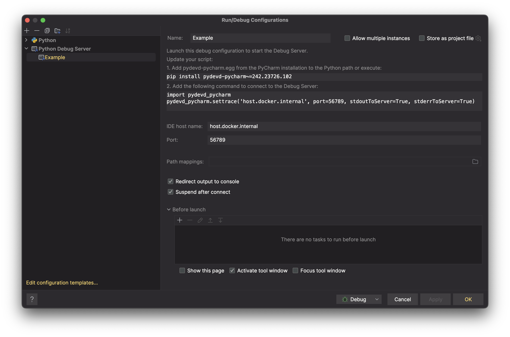

# Pycharm Python Debug Server Setup using Docker

A quick tutorial on how to setup a Python Debug Server in Pycharm using Docker.

_I found myself developing a Python application that required to be run in a Docker container. I wanted to be able to debug the application via breakpoints using Pycharm. This is how I did it._

> NB: this does require a Pycharm Professional version.

This tutorial is also posted as a [blog on my personal website](https://marcelvanworkum.com/python/2024/10/31/python-debug-server-docker.html), if you're interested in more on similar topics.

## Setup

1. Create a python file, e.g. [main.py](./main.py) with the following code:
```python
import pydevd_pycharm

# I'll explain this call in a moment.
pydevd_pycharm.settrace(
    'host.docker.internal',
     port=56789, # Arbitrary, but remember it for later. Pick a port that is not in use.
     stdoutToServer=True,
     stderrToServer=True,
     suspend=True
)
```
2. Create a simple [Dockerfile](./Dockerfile) — nothing special, other than the installatoin of `pydevd-pycharm~=242.23726.102`. This is the Pycharm Python Debug Server package. (You'll likely want to check for the latest version of this package).
3. Create a [Makefile](./Makefile) for convenience.
4. Run `make build`, ensure that our Docker image builds.

Now, if we run ```make run``` we should see the following output:
```
$ make run
This message prints before we attach the debugger
Could not connect to host.docker.internal: 56789
Traceback (most recent call last):
...
(redacted)
...
ConnectionRefusedError: [Errno 111] Connection refused
make: *** [run] Error 1
```

Perfect! This is what we expect. We haven't started the Pycharm Python Debug Server yet.

## Pycharm Setup

1. Open Pycharm, and create a new Run/Debug Configuration — select Python Debug Server.
2. Change `IDE host name` to `host.docker.internal`
3. Change `Port` to `56789` (or whatever port you chose in the `settrace` call in [main.py](./main.py))

Here is what mine looks like:



## Running the Debug Server

1. Run the Python Debug Server configuration in Pycharm.
2. You'll see the following output:
```
Waiting for process connection...
```
3. Now, run `make run` again. You'll see the following output:
```
This message prints before we attach the debugger
pydev debugger: warning: trying to add breakpoint to file that does not exist: ... (will have no effect)
```

You'll see that in your Pycharm window, the following message will appear:


## Source Mapping

The issue here is that the Debug Server needs to know how to map from your local source files, to the ones stored in the Docker container.

You can try `Auto-detect` which is try and automatically map your source files:


But the problem is that this only maps a single file, and it only maps it for _this run of the debugger_...

Instead, we want to add a `Path mapping` in the `Python Debug Server` configuration. That way our debugger will always know how to map our source files, nice!

1. Head to your `Python Debug Server` configuration.
2. Select your `Path mappings` and add a new one.

3. Add a new path mapping, from your local source directory to the directory in the Docker container.


> NB: you can map directories, not just files. So you can map your entire source directory if you wish.

## Run Debug Server, Again

1. Restart your `Python Debug Server` configuration.
2. Run `make run` again.
3. Success! You should see that your Python process has now been halted just after our call to `settrace` in [main.py](./main.py).


Wait a moment, I didn't set a breakpoint in my code? How did it know to stop there?

By default, the `settrace` call will suspend the process immediately after it is called. This is why we see the process suspended at this point. This is useful for ensuring that the debugger is correctly attached when setting up, but once we have things working I prefer to change this to `suspend=False`.

Now we can add breakpoints to our code, and they will be hit as expected.


## Conclusion

That's it! You now have a Python Debug Server running in a Docker container, and you can debug your Python application using Pycharm.

I hope this was helpful. If you have any questions or run into any issues, please let me know by creating an issue on this repository.
